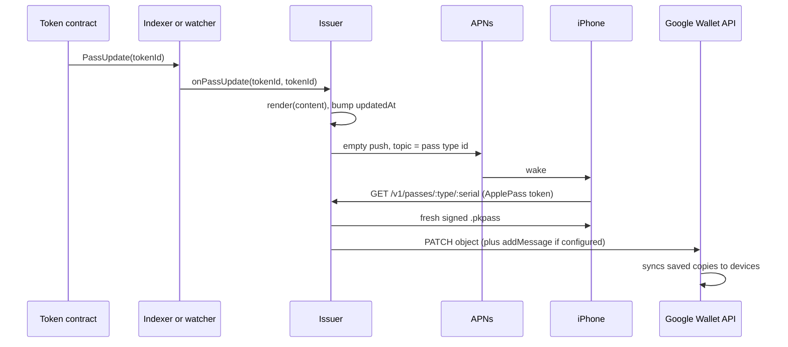
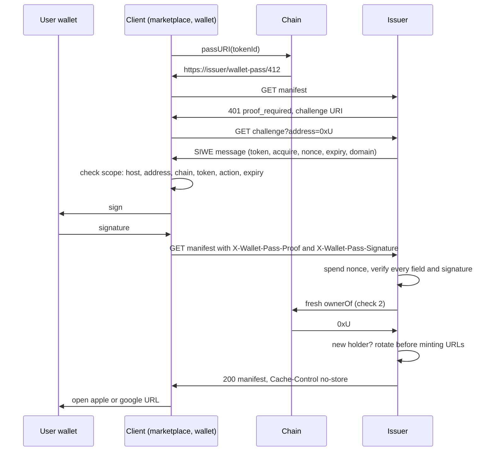
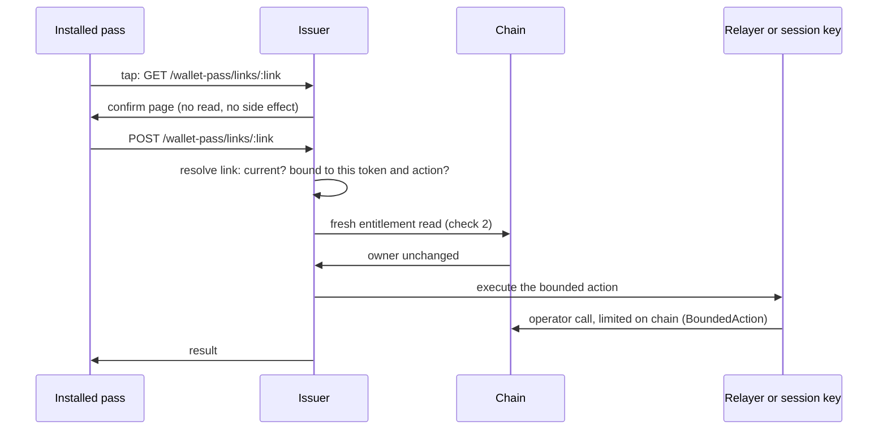

# Concepts

## The three parts of the standard

1. **Discovery.** The token contract implements `IERC721WalletPass` (ERC-165 id `0xef5f1e71`). `passURI(tokenId)` returns a URI that resolves to the pass manifest:

   ```json
   { "formats": { "apple": "https://issuer.example/...", "google": "https://pay.google.com/gp/v/save/..." }, "updatedAt": 1754500000 }
   ```

   `apple` must be served as `application/vnd.apple.pkpass`; `google` must be a Save to Google Wallet link. Clients ignore keys they do not know. `updatedAt` is content freshness, not URL validity.

2. **Freshness.** `PassUpdate(tokenId)` and `BatchPassUpdate(from, to)` (inclusive range) say the pass content changed. Distributors regenerate and push.

3. **Authorization.** A pass is a bearer artifact: it can be forwarded, backed up and installed anywhere. So nothing a pass can trigger is authorized by the pass. Every state-changing action reachable from a pass needs the two checks below.

Only the first two touch the chain. Generation, signing and push are out of scope for the standard; in this SDK they live in [`@erc8426/apple`](../packages/apple/README.md) and [`@erc8426/google`](../packages/google/README.md).

## The two checks

1. **Proof of control of the owning account.** A signature over a verifier-issued challenge naming the token (chain id, contract, token id), the action, a single-use nonce, an expiration and the verifier's identity, plus the account for contract-account signatures. The verifier checks every field against what it holds, never against request values. The SDK serializes challenges as ERC-4361 (SIWE) messages with the token as a CAIP-19 resource and the action as `urn:wallet-pass:action:<name>`.
2. **A fresh entitlement read** (`ownerOf`, or a documented extension such as an ERC-4907 renter or a delegate) at request time, against the best view of the safe head. Never cached from issuance or URL minting.

Check 2 closes the **transfer window**: a sold token stops acting at once, whatever passes are still installed. Check 1 closes **forwarding**: a leaked pass or URL under an unchanged owner. Each challenge field closes its own hole (scope, replay, staleness, cross-verifier reuse). Check 2 is never substitutable.

## Configurations

| | Public | Gated | Capability (a way of operating gated) |
| - | - | - | - |
| Manifest | Served to anyone | 401 `proof_required` until an `acquire` proof arrives | As gated |
| Acquisition URLs are | Public data (anyone can enumerate ids) | Possession proofs, rotated on transfer or first claim | As gated |
| Pass action links | Should not exist | Open a page that asks for a signature (signed path) | Act without a per-action signature, under strict conditions |
| Metadata mirror | Allowed | Must not carry URLs | Must not carry URLs |
| Check 1 met by | The signed action flow | The signed action flow | The capability URL itself |

A client learns the configuration from the manifest response: 200 to an unauthenticated request is public, 401 is gated.

The **capability configuration** exists for email-onboarded products where no per-action user signature exists when a pass link is tapped. The capability URL may stand in for check 1 only if: the deployment is gated; the URL is unguessable, bound to one token and one action, rotates on transfer and on the owner's request; the action cannot transfer, burn or approve the token or change who is entitled; its effect under unlimited repetition is bounded and documented; its on-chain authority should be limited to that one function; and check 2 still runs. What it gives up is forwarding protection; see [security](./security.md#what-the-capability-configuration-gives-up).

## Rotation

Acquisition URLs and action links rotate:

- **On an observed transfer** (watcher or indexer webhook) or **on the new owner's first claim**, whichever comes first. Required in gated.
- **On the owner's signed request** (`POST /wallet-pass/:tokenId/rotate` with a `rotate` proof). Required in the capability configuration, because under an unchanged owner it is the only remedy for a leaked link.

Rotation is not synchronous with the transfer. Between the transfer and rotation, the previous owner's URLs are still cryptographically valid; the fresh read is what refuses them. Rotation closes the residual window; it is not the boundary.

On a transfer, or when the owner resets their pass links, the issuer gives the holder a pass under a new random serial and pushes the old serial as superseded: rendered with `voided: true`, no links, and a `supersededReason` of `transfer` or `reset`. Apple shows it as a voided card; Google expires the object. The old copy stops presenting itself as current, which is what the spec's issuer requirements ask for, and it says why: "Transferred" after a change of hands, "Links reset" with a pointer to the current pass after a reset. Neither platform lets an issuer delete an installed pass, so this wording is what tells the holder their token was not lost. Your `render` receives the same `supersededReason` if you want your own wording.

## PassUpdate flow



## Gated acquisition



A verified proof from an account that is not entitled gets exactly 403, and nothing else uses 403. A chain read that could not be taken is 503 with `Retry-After`, never a refusal.

## A capability action



The GET never acts, so link prefetchers and crawlers cannot trigger anything. On-chain, [`BoundedAction`](../packages/contracts/README.md#bounding-a-pass-reachable-action) caps the operator by action id, rate and value, and lets the token owner revoke it.
