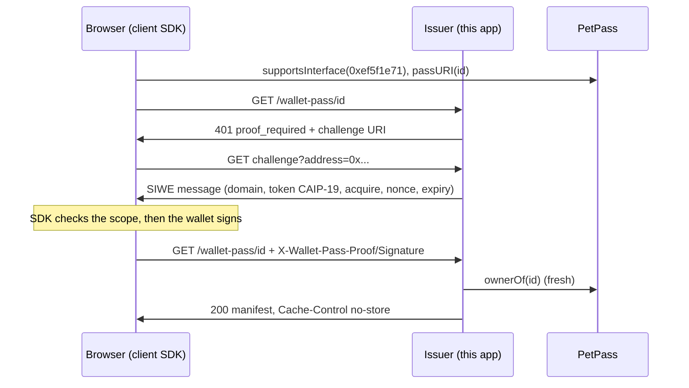

# ERC-8426 Pet Pass: a full example app

An open source, end to end app for [ERC-8426](https://ethereum-magicians.org/t/erc-8426-wallet-pass-extension-for-nfts/29358), the Wallet Pass Extension for NFTs. Hatch a pet NFT, unlock its wallet pass with a signature, care for it through the links on the back of the pass, sell it, and watch the previous owner get refused. Use it to test the protocol, or fork it as the starting point for your own collection.

It runs with **no Apple or Google account**: the pass is drawn in the page from the exact content a wallet would receive. Add credentials and the same app serves real Apple Wallet and Google Wallet passes.

## Quickstart

Needs Node 20+, pnpm and [Foundry](https://getfoundry.sh) (for `anvil`).

```sh
pnpm install && pnpm build                                  # once, from the repository root
pnpm --filter @erc8426-examples/next-app chain              # terminal 1: anvil + PetPass + .env.local
pnpm --filter @erc8426-examples/next-app dev                # terminal 2: http://localhost:3000
```

Open http://localhost:3000, click **Use dev wallet** (or connect a browser wallet on chain 31337), **Hatch a pet**, then **Unlock my pass**.

`pnpm --filter @erc8426-examples/next-app smoke` runs the whole flow headlessly against the running app (mint, 401, challenge, signed manifest, replay, capability link, signed action, 403, transfer, rotation, the on-chain bound, and the conformance suite) and prints one line per check.

## What you can do in the app

| Page | What happens |
| - | - |
| Home | What ERC-8426 is, in three steps, and which delivery mode this instance runs. |
| Hatch | `/api/mint` mints a `PetPass` token to your address (the operator key owns the collection). |
| My passes | The pets you own now, from Transfer logs plus a fresh `ownerOf`. |
| Pass detail | Public on-chain state; **Unlock my pass** (gated manifest with a signed `acquire` proof); a live front and back preview of the pass; Add to Apple Wallet and Save to Google Wallet buttons when configured; care on the **signed path** (`client.signedAction`) and on the **capability path** (the links from the back of the pass); **Reset my pass links** (`client.rotatePassLinks`); a transfer form, after which your proof gets exactly 403 and your old links stop working; a live `PassUpdate` feed (`usePassUpdates`); and an activity log showing every status code. |

## Architecture

```text
 Browser                                   Next.js server (this app)                    Chain
 ==============================            ========================================     ===================
 @erc8426/react                            app/wallet-pass/[...path]/route.ts           PetPass (ERC-721 +
   WalletPassProvider, AddToWalletButton,    @erc8426/issuer createIssuer, gated,        IERC721WalletPass +
   usePassUpdates                            capability links for feed/water/play        BoundedAction)
 @erc8426/client                               GET  /wallet-pass/:id          manifest    passURI(id) =
   getManifest, signedAction,       ======>    GET  /wallet-pass/:id/challenge            base + id
   rotatePassLinks, issuerDisplay              POST /wallet-pass/:id/actions/:action
 wallet: injected or dev burner                POST /wallet-pass/:id/rotate
                                               GET|POST /wallet-pass/links/:link
                                               GET  /wallet-pass/passes/:link  files      ownerOf (fresh read
                                             providers: preview (always), Apple, Google    on every request)
                                             app/api/mint, passes, pets, rpc, dev/fund
 /api/rpc (allowlisted proxy) ==========>    watchTransfers, watchPassUpdates  <======    Transfer, PassUpdate
                                             operator key: mints, relays capped cares ==> feed/water/play
```



Files worth reading first: `lib/server.ts` (the issuer, the care actions and the pass content), `components/PassDetail.tsx` (every client call), `scripts/chain.mjs` and `scripts/smoke.mjs`.

## How each spec requirement shows up

| ERC-8426 requirement | Where you see it |
| - | - |
| `supportsInterface(0xef5f1e71)` and `passURI` (Contract interface) | `PetPass` from `@erc8426/contracts`; the smoke test checks both; the client refuses contracts that fail ERC-165. |
| `passURI` for a nonexistent token reverts | The conformance step of the smoke test. |
| Manifest shape (Pass manifest) | Validated by `@erc8426/client` on every fetch. The extra `preview` format is allowed because clients MUST ignore format keys they do not recognize. |
| Gated configuration: 401 `proof_required` with a `challenge`, no URLs | "Unlock my pass"; `smoke` checks the body. |
| Challenge floor: domain, account, chain, CAIP-19 token, action, nonce, expiry | The issuer builds it; the client refuses to let your wallet sign one whose domain is not this site or whose token, action or account differ. |
| Single-use nonce | `smoke`: replaying a proof is 401 `nonce_invalid`. |
| 403 only for a verified proof from a non-entitled account | Try to unlock a pet you do not own, or after selling it. |
| Fresh `ownerOf` read on every action (check 2) | A sold pet's old links fail at once, before the watcher has even rotated them. |
| `Cache-Control: no-store`, and clients MUST NOT durably cache acquisition URLs | The manifest response; the app keeps the unlocked pass in memory only. |
| Rotation on transfer and on the new owner's first claim | `watchTransfers` in `lib/server.ts`; the new owner's manifest has fresh URLs. |
| Rotation on owner request (MUST in the capability configuration) | "Reset my pass links"; old links answer 404. |
| Capability configuration conditions | Feed, water and play are capability actions with a documented `bound`; they cannot transfer or approve; `BoundedAction` caps them on chain at 4 per pet per day (the 5th answers 429 `bound_reached`). |
| GET on a capability link has no side effect | Open a link in a browser: you get a confirm page; only its POST acts. |
| Issuer SHOULD present the contract; origin consistency (Phishing surface) | The issuer box on the detail page: contract address and "matches this site" via `originMatches`; the Add to Wallet buttons show the contract too. |
| `PassUpdate` / `BatchPassUpdate` | Every care, mint and transfer emits one; the live feed and the issuer's push both run off it. |
| Pass identifiers carry no personal data | Serials are random (shown under the preview). |

## Modes

**Local (default).** `pnpm chain` starts anvil on 8545, generates a fresh operator key at runtime, deploys `PetPass` with `passURI` base `http://localhost:3000/wallet-pass/`, appoints the operator, and writes `.env.local` (gitignored; it keeps any Apple or Google lines you added). If an RPC already answers on 8545 it redeploys there and exits. The dev wallet and its faucet exist only here: they need `DEV_WALLET=1` **and** chain id 31337.

**Testnet.** Deploy to any chain, then point the app at it:

```sh
RPC_URL=https://sepolia.base.org OPERATOR_PRIVATE_KEY=0x... NEXT_PUBLIC_BASE_URL=https://your-app.example \
  pnpm --filter @erc8426-examples/next-app deploy
```

It prints `CHAIN_ID`, `CONTRACT_ADDRESS` and `DEPLOY_BLOCK`. Put those, the same key, and `RPC_URL` in the environment. Users connect a browser wallet; the dev wallet is off. Set `MINT_API=off` if you do not want anyone to mint through the operator.

**Real wallet mode.** Add the Apple and/or Google variables from `.env.example`. Each provider is added only when all of its variables are present, and the Add to Wallet buttons appear for the configured platforms. Apple needs a Pass Type ID certificate and the WWDR G4 intermediate (see `packages/apple/README.md`); Google needs an issuer id and a service account (see `packages/google/README.md`). Apple only calls the PassKit web service (`/apple/v1/...`, mounted by `app/apple/[...path]/route.ts` outside the issuer's `/wallet-pass` tree) over public https, and Google only fetches images from public https, so live updates need a deployed origin.

## Deploying to Vercel

- Set the project root to `examples/next-app` and the install command to run from the monorepo root (`pnpm install`, then `pnpm build` so the workspace packages have `dist`).
- Set `NEXT_PUBLIC_BASE_URL` to the production URL. The SIWE domain is its host, and clients refuse to sign for any other, so preview deployments on other hosts will not verify unless you set it per environment.
- Set `RPC_URL`, `CHAIN_ID`, `CONTRACT_ADDRESS`, `DEPLOY_BLOCK` and `OPERATOR_PRIVATE_KEY` (as a sensitive variable). Never set `DEV_WALLET`.
- **State.** The issuer's default stores are in memory, and serverless functions do not share memory, so a nonce issued by one instance is unknown to another. For anything beyond a demo, pass `stores: kvStores(kv)` to `createIssuer` in `lib/server.ts` with Upstash Redis or Vercel KV (the issuer README shows the ten line adapter). The chain watchers also need a long-lived process; on serverless, call `issuer.onTransfer` and `issuer.onPassUpdate` from an indexer webhook instead.
- Apple's `passkit-generator` is kept out of the bundle (`serverExternalPackages` in `next.config.mjs`).

## Security notes

- The operator key never leaves the server. The browser reads the chain through `/api/rpc`, an allowlisted proxy that forwards reads and already signed transactions only.
- The dev wallet key is stored in `localStorage` by design: it is a throwaway for a local chain. Never do this with a real key.
- `/api/mint` is open. It is a demo convenience, not a pattern.
- This is teaching code built on tested packages, not an audited product.

## License

MIT
